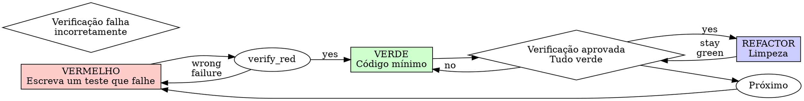

--- 
name: desenvolvimento-orientado-a-testes
description: "Use ao implementar qualquer funcionalidade ou correção de bug, antes de escrever o código de implementação"
risk: desconhecido
source: comunidade
date_add: "27/02/2026"
---

# Desenvolvimento Orientado a Testes (TDD)

## Visão Geral

Escreva o teste primeiro. Observe-o falhar. Escreva o mínimo de código possível para que ele passe.

**Princípio fundamental:** Se você não observou o teste falhar, não sabe se ele testa a coisa certa.

**Violar a letra das regras é violar o espírito das regras.**

## Quando usar
**Sempre:**
- Novas funcionalidades
- Correções de bugs
- Refatoração
- Alterações de comportamento

**Exceções (consulte seu parceiro humano):**

- Protótipos descartáveis
- Código gerado
- Arquivos de configuração

Pensando em "pular o TDD só desta vez"? Pare. Isso é racionalização.

## A Lei de Ferro

```
NENHUM CÓDIGO DE PRODUÇÃO SEM UM TESTE QUE FALHE PRIMEIRO
```

Escreveu código antes do teste? Apague-o. Comece de novo.

**Sem exceções:**
- Não o mantenha como "referência"
- Não o "adapte" enquanto escreve os testes
- Não o olhe
- Apagar significa apagar

Implemente do zero a partir dos testes. Ponto final.

## Vermelho-Verde-Refatorar



### VERMELHO - Escreva um teste com falha

Escreva um teste mínimo mostrando o que deveria acontecer.

<Bom>
```typescript
test('tenta 3 vezes a operação que falhou', async () => {

let tentativas = 0;

const operação = () => {

tentativas++;

if (tentativas < 3) throw new Error('falha');

return 'sucesso';

};

const resultado = await retryOperation(operação);

expect(resultado).toBe('sucesso');

expect(tentativas).toBe(3);
});
``` Nome claro, testa o comportamento real, uma coisa só

</Bom>

<Ruim>
```typescript
test('retry works', async () => {

const mock = jest.fn()

.mockRejectedValueOnce(new Error())

.mockRejectedValueOnce(new Error())

.mockResolvedValueOnce('success');

await retryOperation(mock);

expect(mock).toHaveBeenCalledTimes(3);
});

``` Nome vago, testa mocks, não código
</Ruim>

**Requisitos:**
- Um comportamento
- Nome claro
- Código real (sem mocks, a menos que seja inevitável)

### Verificar VERMELHO - Observe a Falha

**OBRIGATÓRIO.** Nunca pule.**

```bash
npm test path/to/test.test.ts
```

Confirme:
- O teste falha (não apresenta erros)
- A mensagem de falha é esperada
- Falha porque o recurso está ausente (não por erros de digitação)

**O teste passa?** Você está testando um comportamento existente. Corrija o teste.

**O teste apresenta erros?** Corrija o erro e execute novamente até que falhe corretamente.

### VERDE - Código Mínimo

Escreva o código mais simples para passar no teste.

<Bom>
```typescript
async function retryOperation<T>(fn: () => Promise<T>): Promise<T> {

for (let i = 0; i < 3; i++) {

try {
return await fn();

} catch (e) {

if (i === 2) throw e;

}

}
throw new Error('unreachable');

}
```
Suficiente para passar
</Bom>

<Ruim>
```typescript
async function retryOperation<T>(

fn: () => Promise<T>,

options?: {

maxRetries?: number;

backoff?: 'linear' | 'exponential';

onRetry?: (attempt: number) => void;

}
): Promise<T> {

// YAGNI
}
```
Excesso de engenharia
</Ruim>

Não adicione recursos, refatore outros códigos ou "melhore" além do teste.

### Verificar VERDE - Observe se passa

**OBRIGATÓRIO.**

```bash
npm test path/to/test.test.ts
```

Confirme:
- O teste passa
- Outros testes também passam
- Saída impecável (sem erros ou avisos)

**O teste falhou?** Corrija o código, não o teste.

**Outros testes falham?** Corrija agora.

### REFACTOR - Limpeza

Após passar:
- Remova duplicatas
- Melhore os nomes
- Extraia funções auxiliares

Mantenha os testes passando. Não adicione comportamentos.

### Repita

Próximo teste com falha para a próxima funcionalidade.

## Bons Testes

| Qualidade | Boa | Ruim |

|---------|------|-----|

| **Mínimo** | Apenas um item. "e" no nome? Separe-o. | `test('valida e-mail, domínio e espaços em branco')` |

| **Claro** | O nome descreve o comportamento | `test('test1')` |

| **Mostra a intenção** | Demonstra a API desejada | Oculta o que o código deveria fazer |

## Por que a ordem importa

**"Vou escrever os testes depois para verificar se funciona"**

Testes escritos após o código passam imediatamente. Passar imediatamente não prova nada:
- Pode testar a coisa errada
- Pode testar a implementação, não o comportamento
- Pode deixar passar casos extremos que você esqueceu
- Você nunca viu o bug ser detectado

A abordagem TD-First (Test First) força você a ver o teste falhar, provando que ele realmente testa algo.

**"Eu já testei manualmente todos os casos extremos"**

Testes manuais são ad hoc. Você acha que testou tudo, mas:
- Não há registro do que você testou
- Não é possível executar novamente quando o código muda
- É fácil esquecer casos sob pressão
- "Funcionou quando eu testei" ≠ abrangente

Testes automatizados são sistemáticos. Eles são executados da mesma maneira todas as vezes.

**"Excluir X horas de trabalho é um desperdício"**

Falácia do custo irrecuperável. O tempo já foi gasto. Sua escolha agora:
- Excluir e reescrever com TDD (X horas a mais, alta confiança)
- Manter e adicionar testes depois (30 minutos, baixa confiança, prováveis ​​bugs)

O "desperdício" é manter código em que você não confia. Código funcional sem testes reais é dívida técnica.

**"TDD é dogmático, ser pragmático significa se adaptar"**

TDD É pragmático:
- Encontra bugs antes do commit (mais rápido do que depurar depois)
- Previne regressões (os testes detectam falhas imediatamente)
- Documenta o comportamento (os testes mostram como usar o código)
- Permite refatoração (altere livremente, os testes detectam falhas)

Atalhos "pragmáticos" = depuração em produção = mais lenta.

**"Testes posteriores atingem os mesmos objetivos - é espírito, não ritual"**

Não. Testes posteriores respondem "O que isso faz?". Testes iniciais respondem "O que isso deveria fazer?".

Testes posteriores são influenciados pela sua implementação. Você testa o que construiu, não o que é necessário. Você verifica casos extremos lembrados, não os descobertos.

Testes primeiro forçam a descoberta de casos extremos antes da implementação. Testes depois verificam se você se lembrou de tudo (você não se lembrou).

30 minutos de testes depois ≠ TDD. Você ganha cobertura, mas perde a prova de que os testes funcionam.

## Racionalizações Comuns

| Desculpa | Realidade |

|--------|---------|
| "Muito simples para testar" | Código simples quebra. O teste leva 30 segundos. |

| "Vou testar depois" | Testes que passam imediatamente não provam nada. |

| "Testes depois atingem os mesmos objetivos" | Testes depois = "o que isso faz?" Testes primeiro = "o que isso deveria fazer?" |

| "Já testado manualmente" | Ad hoc ≠ sistemático. Sem registro, não pode ser executado novamente. |

| "Excluir X horas é um desperdício" | Falácia do custo irrecuperável. Manter código não verificado é dívida técnica. |

| "Mantenha como referência, escreva os testes primeiro" | Você vai adaptá-lo. Isso é testar depois. Excluir significa excluir. |
| "Preciso explorar primeiro" | Ótimo. Descarte a exploração e comece com TDD. |
| "Testar muito = design pouco claro" | Ouça os testes. Difícil de testar = difícil de usar. |
| "TDD vai me atrasar" | TDD é mais rápido que depurar. Pragmático = teste primeiro. |
| "Teste manual mais rápido" | Teste manual não prova casos extremos. Você vai testar novamente cada alteração. |

| "O código existente não tem testes" | Você está melhorando-o. Adicione testes ao código existente. |

## Sinais de Alerta - PARE e Recomece

- Código antes do teste
- Teste após a implementação
- Teste passa imediatamente
- Não consigo explicar por que o teste falhou
- Testes adicionados "posteriormente"
- Justificativa "só desta vez"
- "Eu já testei manualmente"
- "Testes posteriores atingem o mesmo objetivo"
- "É uma questão de espírito, não de ritual"
- "Manter como referência" ou "adaptar o código existente"
- "Já gastei X horas, excluir é um desperdício"
- "TDD é dogmático, estou sendo pragmático"
- "Isso é diferente porque..."

**Tudo isso significa: Exclua o código. Recomece com TDD.**

## Exemplo: Correção de Bug

**Bug:** E-mail vazio aceito

**VERMELHO**
```typescript
test('rejects empty email', async () => {

const result = await submitForm({ email: '' });

expect(result.error).toBe('Email required');
}); ```

**Verificar VERMELHO**
```bash
$ npm test
FALHA: esperava-se 'Email obrigatório', mas foi encontrado undefined
```

**VERDE**
```typescript
function submitForm(data: FormData) {

if (!data.email?.trim()) {

return { error: 'Email obrigatório' };

}
// ...
}
```

**Verificar VERDE**
```bash
$ npm test
APROVADO
```

**REFACTOR**
Extrair a validação para múltiplos campos, se necessário.

## Lista de Verificação

Antes de marcar o trabalho como concluído:

- [ ] Cada nova função/método possui um teste
- [ ] Observei cada teste falhar antes de implementá-lo
- [ ] Cada teste falhou pelo motivo esperado (recurso ausente, não erro de digitação)
- [ ] Escrevi o código mínimo necessário para passar em cada teste
- [ ] Todos os testes foram aprovados
- [ ] Saída impecável (sem erros ou avisos)
- [ ] Os testes utilizam código C real