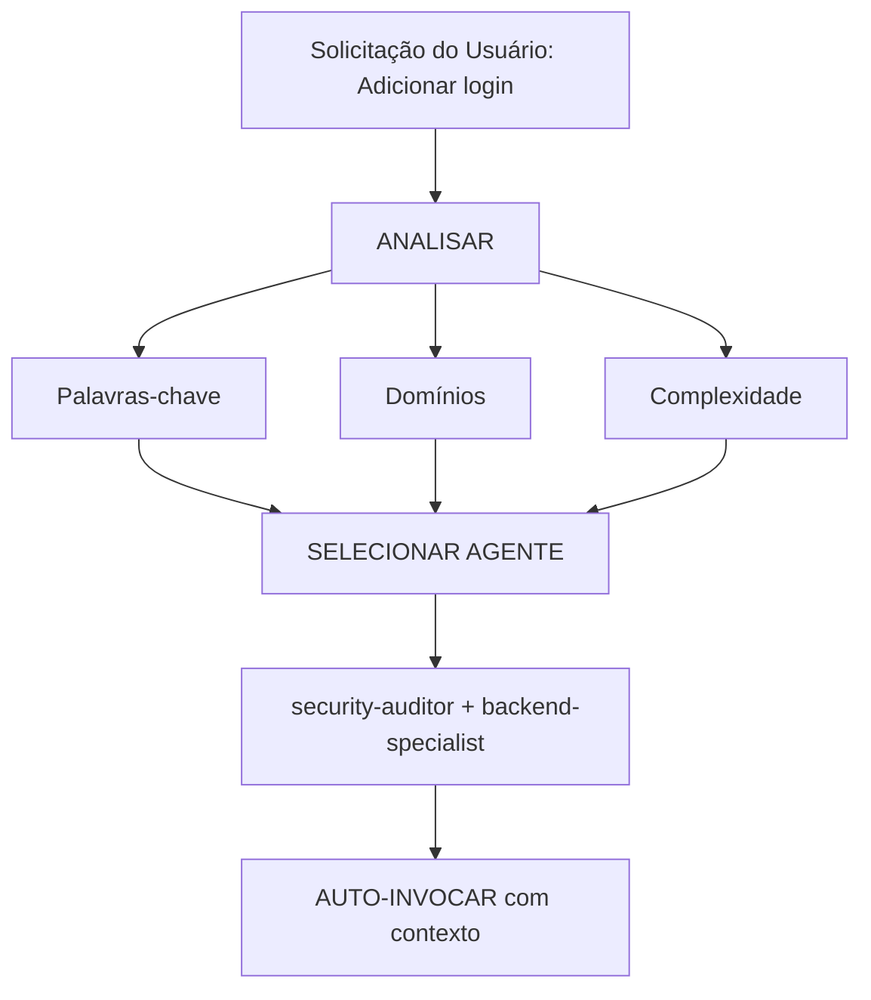

nome: roteamento_inteligente
descrição: Seleção automática de agentes e roteamento inteligente de tarefas. Analisa as solicitações do usuário e seleciona automaticamente o(s) agente(s) especialista(s) mais adequado(s), sem exigir menções explícitas do usuário.
version: 1.0.0
---

# Roteamento Inteligente de Agentes

**Objetivo**: Analisar automaticamente as solicitações do usuário e direcioná-las ao(s) agente(s) especialista(s) mais apropriado(s), sem exigir que o usuário mencione agentes explicitamente.

## Princípio Central

> **A IA deve agir como um Gerente de Projetos inteligente**, analisando cada solicitação e selecionando automaticamente o(s) especialista(s) mais adequado(s) para a tarefa.

## Como Funciona

### 1. Análise da Solicitação

Antes de responder a QUALQUER solicitação do usuário, realizar uma análise automática:



### 2. Matriz de Seleção de Agentes

**Use esta matriz para selecionar agentes automaticamente:**

| Intenção do Usuário      | Palavras-chave                                 | Agente(s) Selecionado(s)                                       | Auto-invocar? |
| ------------------------ | ---------------------------------------------- | -------------------------------------------------------------- | ------------- |
| **Autenticação**         | "login", "auth", "signup", "password"          | `auditor-de-segurança` + `especialista em back-end`            | ✅ SIM        |
| **Componente de UI**     | "button", "card", "layout", "style"            | `especialista em front-end`                                    | ✅ SIM        |
| **UI Mobile**            | "screen", "navigation", "touch", "gesture"     | `desenvolvedor-mobile`                                         | ✅ SIM        |
| **Endpoint de API**      | "endpoint", "route", "API", "POST", "GET"      | `especialista em back-end`                                     | ✅ SIM        |
| **Banco de Dados**       | "schema", "migration", "query", "table"        | `arquiteto-de-banco-de-dados` + `especialista em back-end`     | ✅ SIM        |
| **Correção de Bug**      | "error", "bug", "not working", "broken"        | `depurador`                                                    | ✅ SIM        |
| **Testes**               | "test", "coverage", "unit", "e2e"              | `engenheiro-de-testes`                                         | ✅ SIM        |
| **Deploy**               | "deploy", "production", "CI/CD", "docker"      | `engenheiro-devops`                                            | ✅ SIM        |
| **Revisão de Segurança** | "security", "vulnerability", "exploit"         | `auditor-de-segurança` + `testador-de-penetração`              | ✅ SIM        |
| **Performance**          | "slow", "optimize", "performance", "speed"     | `otimizador-de-desempenho`                                     | ✅ SIM        |
| **Definição de Produto** | "requirements", "user story", "backlog", "MVP" | `dono-do-produto`                                              | ✅ SIM        |
| **Nova Funcionalidade**  | "build", "create", "implement", "new app"      | `agente-orquestrador` → multi-agente                           | ⚠️ PERGUNTAR  |
| **Tarefa Complexa**      | Múltiplos domínios detectados                  | `agente-orquestrador` → multi-agente                           | ⚠️ PERGUNTAR  |

### 3. Protocolo de Roteamento Automático

## TIER 0 – Análise Automática (SEMPRE ATIVA)

Antes de responder a QUALQUER solicitação:

```javascript
// Pseudo-código da árvore de decisão
function analyzeRequest(userMessage) {
    // 1. Classificar tipo de solicitação
    const requestType = classifyRequest(userMessage);

    // 2. Detectar domínios
    const domains = detectDomains(userMessage);

    // 3. Determinar complexidade
    const complexity = assessComplexity(domains);

    // 4. Selecionar agente(s)
    if (complexity === "SIMPLE" && domains.length === 1) {
        return selectSingleAgent(domains[0]);
    } else if (complexity === "MODERATE" && domains.length <= 2) {
        return selectMultipleAgents(domains);
    } else {
        return "agente-orquestrador"; // Tarefa complexa
    }
}
```

## 4. Formato de Resposta

**Ao selecionar automaticamente um agente, informe o usuário de forma concisa:**

```markdown
🤖 **Aplicando o conhecimento de `@auditor-de-segurança` + `@especialista em back-end`...**

[Prosseguir com a resposta especializada]
```

**Benefícios:**

* ✅ O usuário vê qual expertise está sendo aplicada
* ✅ Decisão transparente
* ✅ Continua automático (sem necessidade de /comandos)

## Regras de Detecção de Domínio

### Tarefas de Domínio Único (Auto-invocar um agente)

| Domínio         | Padrões                                    | Agente                        |
| --------------- | ------------------------------------------ | ----------------------------- |
| **Segurança**   | auth, login, jwt, password, hash, token    | `auditor-de-segurança`        |
| **Frontend**    | component, react, vue, css, html, tailwind | `especialista em front-end`   |
| **Backend**     | api, server, express, fastapi, node        | `especialista em back-end`    |
| **Mobile**      | react native, flutter, ios, android, expo  | `desenvolvedor-mobile`        |
| **Banco**       | prisma, sql, mongodb, schema, migration    | `arquiteto-de-banco-de-dados` |
| **Testes**      | test, jest, vitest, playwright, cypress    | `engenheiro-de-testes`        |
| **DevOps**      | docker, kubernetes, ci/cd, pm2, nginx      | `engenheiro-devops`           |
| **Debug**       | error, bug, crash, not working, issue      | `depurador`                   |
| **Performance** | slow, lag, optimize, cache, performance    | `otimizador-de-desempenho`    |
| **SEO**         | seo, meta, analytics, sitemap, robots      | `especialista-em-seo`         |
| **Games**       | unity, godot, phaser, game, multiplayer    | `desenvolvedor-de-jogos`      |

### Tarefas Multi-Domínio (Auto-invocar agente-orquestrador)

Se a solicitação corresponder a **2 ou mais domínios de categorias diferentes**, usar automaticamente o `agente-orquestrador`:

```text
Exemplo: "Criar um sistema de login seguro com UI em dark mode"
→ Detectado: Segurança + Frontend
→ Auto-invocar: agente-orquestrador
→ O agente-orquestrador coordena: auditor-de-segurança, especialista em front-end, engenheiro-de-testes
```

## Avaliação de Complexidade

### SIMPLES (Invocação direta)

* Alteração em um único arquivo
* Tarefa clara e específica
* Um único domínio

**Ação**: Auto-invocar o agente correspondente

### MODERADA (2–3 agentes)

* 2–3 arquivos afetados
* Requisitos claros
* Máx. 2 domínios

**Ação**: Auto-invocar agentes relevantes em sequência

### COMPLEXA (agente-orquestrador obrigatório)

* Múltiplos arquivos/domínios
* Decisões arquiteturais
* Requisitos pouco claros

**Ação**: Auto-invocar `agente-orquestrador` → fará perguntas socráticas

## Regras de Implementação

### Regra 1: Análise Silenciosa

* ❌ Não anunciar “estou analisando…”
* ✅ Analisar silenciosamente
* ✅ Informar qual agente está sendo aplicado

### Regra 2: Informar Seleção do Agente

```markdown
🤖 **Aplicando o conhecimento de `@especialista em front-end`...**

Vou criar o componente com as seguintes características:
[continua]
```

### Regra 3: Experiência Fluida

**O usuário não deve perceber diferença entre falar com você ou diretamente com o especialista correto.**

### Regra 4: Capacidade de Override

O usuário pode mencionar agentes explicitamente:

```text
Usuário: "Use @especialista em back-end para revisar isso"
→ Ignorar seleção automática
→ Usar o agente especificado
```

## Casos de Borda

### Caso 1: Pergunta Genérica

```text
Usuário: "Como o React funciona?"
→ Tipo: PERGUNTA
→ Nenhum agente necessário
→ Responder diretamente
```

### Caso 2: Solicitação Muito Vaga

```text
Usuário: "Melhore isso"
→ Complexidade: INCERTA
→ Ação: Fazer perguntas de esclarecimento
```

### Caso 3: Padrões Contraditórios

```text
Usuário: "Adicionar suporte mobile ao app web"
→ Conflito: mobile vs web
→ Perguntar: "Responsivo ou app nativo?"
```

## Integração com Workflows Existentes

### Com o comando `/orquestrador`

* Usuário usa `/orquestrador`: modo explícito
* IA detecta tarefa complexa: mesmo resultado

### Com Socratic Gate

* O roteamento NÃO ignora perguntas de esclarecimento
* Primeiro clarifica, depois roteia

### Com regras do GEMINI.md

* Prioridade: GEMINI.md > roteamento_inteligente
* Roteamento inteligente é o padrão

## Testando o Sistema

### Casos de Teste

**Teste 1 – Frontend simples**
"Create a dark mode toggle button" → especialista em front-end

**Teste 2 – Segurança**
"Review the authentication flow" → auditor-de-segurança

**Teste 3 – Multi-domínio**
"Build a chat app" → orquestrador

**Teste 4 – Bug**
"Login returning 401" → depurador

## Considerações de Performance

* Overhead: ~50–100 tokens
* Trade-off: mais precisão, menos retrabalho
* Economia geral de tokens

## Educação do Usuário (Opcional)

```markdown
💡 Dica: Estou configurado com seleção automática de agentes especialistas.
Você ainda pode mencionar agentes explicitamente com `@agent-name`.
```

## Depuração do Roteamento

Adicionar temporariamente no GEMINI.md:

```markdown
## DEBUG: Intelligent Routing
- Domínios detectados: [...]
- Agente selecionado: [...]
- Justificativa: [...]
```

## Resumo

O **intelligent-routing** oferece:

✅ Zero comandos
✅ Seleção automática de especialistas
✅ Transparência
✅ Integração total com workflows
✅ Override manual
✅ Fallback para orchestrator

**Resultado**: respostas de nível especialista sem o usuário precisar conhecer a arquitetura interna.

---

**Próximo passo**: Integrar essa skill às regras TIER 0 do `GEMINI.md`.

